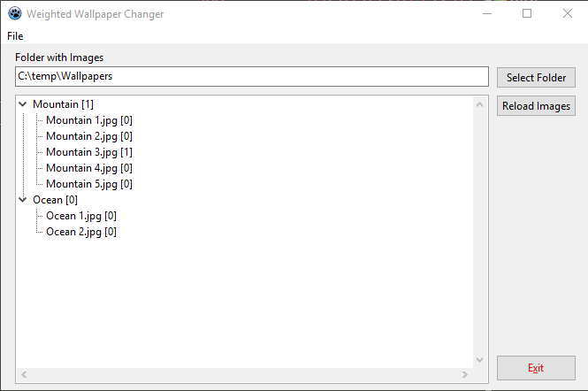

# Weighted Wallpaper Changer

Version 1.0 \
Platform: Windows

## Description

Imagine that you have folder with wallpaper images, e.g.
* Mountain 1.jpg
* Mountain 2.jpg
* Mountain 3.jpg
* Mountain 4.jpg
* Mountain 5.jpg
* Ocean 1.jpg
* Ocean 2.jpg

If you use standard system slideshow with random image selection,
you will see much more mountain images than the ocean images because
each image has the same probability. That means that there is
`5/7 = 71 %` probability of showing mountain image and only `2/7 = 29 %`
probability of showing the ocean.

*Weighted Wallpaper Changer* will use the first word in image name
as a name of a group (category). When there is time to change the image
it will first select the category and then an image from the category.
So each group of images has the same probability. It means that in the
given example, there is `50/50` probability of showing either mountain
or the ocean image.

## Screenshot

## Running

The app runs minimized in the tray. Also the minimize and close button
actually minimizes the app into the tray.

Double click on the tray icon to open GUI where you can select folder
with images.

Right click on the tray icon to open popup many where you can completely
close the application (possible also from the GUI).

## Exact rules

Only file names ending with `.jpg` or `.jpeg` (case insensitive) are
considered.

Name of a group consists of all characters from the filename from the
beginning to either first whitespace (space, tab etc.) or the dot (.).

`Mountain 1.jpg` ==> group is `Mountain` \
`Mountain1.jpg`  ==> group is `Mountain1` !

So don't forget the put e.g. space after group.

It is OK for a group to have a single image.

Names of groups are case sensitive, i.e. `Mountain` and `mountain` are
different group.

## Limititations

Only for Windows.

The interval for changing the images is hardcoded to 1 minute :)

